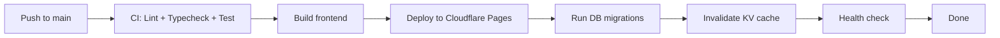

# 25 — Deployment

> Deployment strategy for QuantBit V2.

---

## Deployment Pipeline



---

## Deployment Commands

```bash
# Build frontend
npm run build          # Vite build → dist/

# Deploy to Cloudflare Pages
npx wrangler pages deploy dist --project-name=quantbit-v2

# Run database migrations
npx wrangler d1 migrations apply quantbit-v2-db --remote

# Seed initial data (fresh database only)
npm run db:seed

# Full deploy (CI/CD does all of these)
npm run deploy
```

---

## Environment Setup

### Local Development
```bash
npm install
cp .env.example .env.local
npx wrangler d1 migrations apply quantbit-v2-db --local
npm run dev            # Vite dev server + wrangler dev
```

### Preview Deployment
```bash
# Each PR gets its own preview URL
npx wrangler pages deploy dist --project-name=quantbit-v2 --branch=<branch>
```

### Production Deployment
```bash
# Only from main branch
npx wrangler pages deploy dist --project-name=quantbit-v2 --branch=main
```

---

## GitHub Actions Workflow

```yaml
# .github/workflows/deploy.yml
name: Deploy
on:
  push:
    branches: [main]

jobs:
  test:
    runs-on: ubuntu-latest
    steps:
      - uses: actions/checkout@v4
      - uses: actions/setup-node@v4
        with:
          node-version: 22
          cache: "npm"
      - run: npm ci
      - run: npm run lint
      - run: npm run typecheck
      - run: npm run test:unit
      - run: npm run test:golden

  deploy:
    needs: test
    runs-on: ubuntu-latest
    steps:
      - uses: actions/checkout@v4
      - uses: actions/setup-node@v4
        with:
          node-version: 22
      - run: npm ci
      - run: npm run build
      - run: npx wrangler pages deploy dist --project-name=quantbit-v2 --branch=main
        env:
          CLOUDFLARE_API_TOKEN: ${{ secrets.CLOUDFLARE_API_TOKEN }}
          CLOUDFLARE_ACCOUNT_ID: ${{ secrets.CLOUDFLARE_ACCOUNT_ID }}
      - run: npx wrangler d1 migrations apply quantbit-v2-db --remote
        env:
          CLOUDFLARE_API_TOKEN: ${{ secrets.CLOUDFLARE_API_TOKEN }}
          CLOUDFLARE_ACCOUNT_ID: ${{ secrets.CLOUDFLARE_ACCOUNT_ID }}
```

---

## Versioning Strategy

**API versioning:**
- Prefix: `/api/v1/...`
- Breaking changes → new version (`/api/v2/...`)
- Old version maintained for minimum 1 release cycle

**App versioning:**
- Semantic versioning: `v1.2.3`
- Major: Breaking UI/API changes
- Minor: New features
- Patch: Bug fixes

---

## Rollback Strategy

```bash
# Rollback frontend
npx wrangler pages deploy dist --project-name=quantbit-v2 --branch=main --commit-hash=<previous-hash>

# Rollback database
npx wrangler d1 migrations apply quantbit-v2-db --remote --revert=<migration-name>
```

**Rollback triggers:**
- Error rate > 5% after deployment
- P0 security issue discovered in new version
- Database corruption or data loss

---

## Monitoring After Deploy

```bash
# Check deployment status
npx wrangler pages deployment list --project-name=quantbit-v2

# Check D1 status
npx wrangler d1 info quantbit-v2-db

# Check function logs
npx wrangler pages functions tail quantbit-v2

# Health check endpoint
curl https://quantbit-v2.pages.dev/api/v1/admin/health
```

---

## Secrets Management

```bash
# Set secrets in Cloudflare
npx wrangler pages secret put OPENROUTER_API_KEY quantbit-v2
npx wrangler pages secret put CRON_SECRET quantbit-v2
npx wrangler pages secret put ADMIN_KEY quantbit-v2

# Set secrets in GitHub Actions
gh secret set CLOUDFLARE_API_TOKEN --repo InitialJawa/quantbit-v2
gh secret set CLOUDFLARE_ACCOUNT_ID --repo InitialJawa/quantbit-v2
gh secret set CRON_SECRET --repo InitialJawa/quantbit-v2
```

---

## Deployment Checklist (Pre-Launch)

- [ ] All env vars set in Cloudflare dashboard
- [ ] All secrets set in GitHub Actions
- [ ] D1 migrations applied to production
- [ ] D1 seeded with historical data
- [ ] KV namespace created
- [ ] Custom domain configured (DNS + Cloudflare)
- [ ] SSL enabled (Cloudflare automatic)
- [ ] Rate limits configured
- [ ] Monitoring/alerts configured
- [ ] Rollback plan documented
- [ ] Load testing completed (basic)
- [ ] Security audit passed
